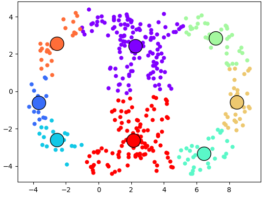

# PythonG1

---
##  Comenzando

### 📋 Pre-requisitos 

Instalamos las librerias mediante pip
```
pip install requeriments.txt
```

### 🔧 Instalación 

Ejecutar los sprints en un entorno de desarrollo

```
python manage.py runserver
```

---
## ⚙️ Ejecutando las pruebas 
#### Formulario para el algoritmo


#### Grafico


## 🛠️ Construido con 🛠️

* [Python](https://docs.python.org/3/) - Uno de los lenguajes mas usados

